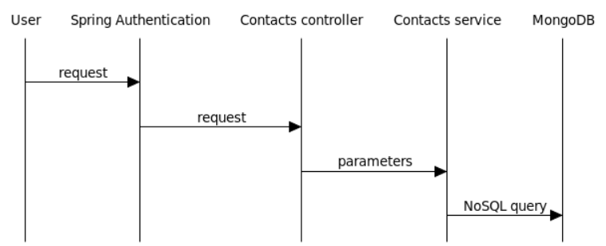
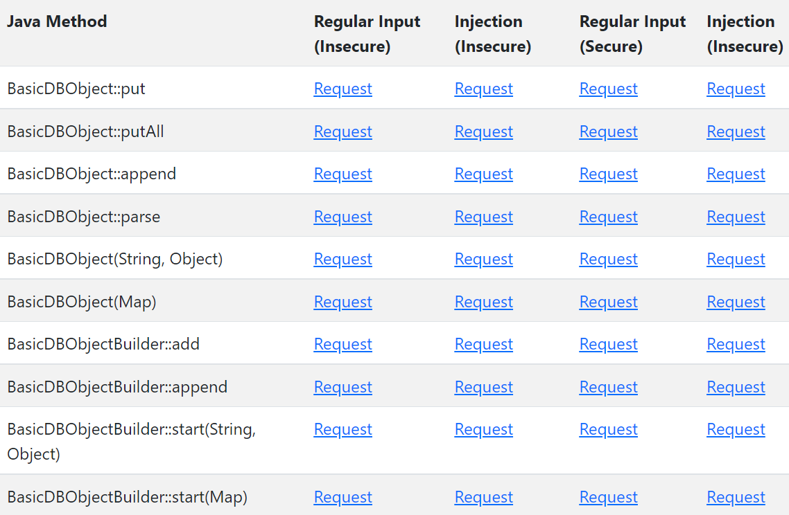

# NoSQL Injection Vulnerable App (NIVA) 
## MongoDB + Java Driver edition


NIVA is a simple web application which is intentionally vulnerable to NoSQL injection. The purpose of this project is to facilitate a better understanding of the NoSQL injection vulnerability among a wide audience of software engineers, security engineers, pentesters, and trainers. This is achieved by giving users both secure and insecure code examples which they can run and inspect on their own, complimented by easy to read documentation.

This edition utilizes MongoDB as the NoSQL database and the official Java driver for data access.

# Setup

## Docker
```
docker pull aabashkin/niva
docker run -p 8080:8080 aabashkin/niva
```

## Maven

```
git clone https://github.com/aabashkin/nosql-injection-vulnapp-mongodb-java.git
cd nosql-injection-vulnapp-mongodb-java
mvn clean package
java -jar target/nosql-injection-vulnapp-mongodb-java-[VERSION].jar
```

## Packaged Sources

Download the latest JAR from the Releases page and run:
`java -jar nosql-injection-vulnapp-mongodb-java-[VERSION].jar`

# Functional Overview

The app allows the user to search their list of contacts by email address. 

A successful match returns the entire contact card of the individual, including other sensitive information such as phone number and physical address.

The basic data flow is:
1. Spring authenticates user
2. The Contacts controller reads the `email` parameter and gets `userName` from the request context
3. The Contacts controller calls the Contacts service with the `email` and `userName` parameters
4. The Contacts service generates and executes a NoSQL query which searches for contacts where the `email` request parameter matches the `email` field and the user name matches the `sharedWith` field



## URL Design

The basic URL path:

`/contacts/search?email=...`

Since we are testing both secure and insecure usage of several different driver APIs, we must add some prefixes to our path:

`/[secure|insecure]/[class-method]/contacts/search?email=...`

A typical request:
`http://localhost:8080/insecure/basicdbobject-put/contacts/search?email=contact1@private.info`

## Authentication

The app uses Basic Authentication. Three users are hardcoded:

`user1:pass1`
`user2:pass2`
`user3:pass3`

# Testing 
Tests are located in the root of the web application:
`http://localhost:8080/`

The testing page contains a number of links to both secure and insecure endpoints, with options for both regular expected input as well as an example attack vector:




# Walkthrough
This walkthrough will cover the basics of NoSQL injection and then dive into specific examples using the vulnerable app

## NoSQL Injection Overview
NoSQL injection is similar to all other classes of injection in the sense that it exploits a vulnerability in an application which is caused by the fact that the application does not properly distinguish between code and data. This vulnerability allows an attacker to modify the original query.

In order to understand this attack, one first needs to be familiar with how NoSQL queries work in general.

A NoSQL query defined via a Java driver:
```java
BasicDBObject query = new BasicDBObject();
query.put("sharedWith", userName);
query.put("email", email);

MongoCursor<Document> cursor = collection.find(query).iterator();
```

Which generates the following query for the NoSQL database:
```JSON
{
    "sharedWith" : "user1",
    "email" : "contact1@private.info"
}
```

And returns the following result:
```JSON
[
    {
        "_id": {
            "timestamp": 1658187271,
            "date": "2022-07-18T23:34:31.000+00:00"
        },
        "email": "contact1@private.info",
        "address": "123 Fake St",
        "phone": "111-111-1111",
        "sharedWith": "user1"
    }
]
```

A typical NoSQL injection vulnerability appears in the code when the query utilizes string concatentation as opposed to parameterization. The `$where` clause is often the culprit:
```java
BasicDBObject query = new BasicDBObject();
query.put("$where", "this.sharedWith == \"" + userName + "\" && this.email == \"" + email + "\"");
```

An attacker exploits this vulnerability by sending a specially crafted request which manipulates the query. In this particular example, the attacker doesn't have control of `userName` request parameter since it is determined internally by the application. However, the attacker does control the `email` request parameter, so this is what we will focus on.

Before the attacker can manipulate the query they must break out of the current one. Since the `email` query parameter in the code is quoted, the attacker begins their `email` request parameter value with a double quote `"`.

Next, the attacker must find a way to return all of the documents in the collection. One way to accomplish this is to add a condition to the query which always evaluates to true. For example, `|| "4" != "5`

Putting this together, the final malicious `email` request parameter is:
`" || "4" != "5` 

After applying URI encoding, the final request string is:
`http://localhost:8080/insecure/basicdbobject-put/contacts/search?email=%22%20%7C%7C%20%224%22%20!%3D%20%225`

Executing this request returns all the documents in the collection:
```JSON
[
    {
        "_id": {
            "timestamp": 1657839281,
            "date": "2022-07-14T22:54:41.000+00:00"
        },
        "email": "contact1@private.info",
        "address": "123 Fake St",
        "phone": "111-111-1111",
        "sharedWith": "user1"
    },
    {
        "_id": {
            "timestamp": 1657839281,
            "date": "2022-07-14T22:54:41.000+00:00"
        },
        "email": "contact2@private.info",
        "address": "456 Fake St",
        "phone": "222-222-2222",
        "sharedWith": "user2"
    },
    {
        "_id": {
            "timestamp": 1657839281,
            "date": "2022-07-14T22:54:41.000+00:00"
        },
        "email": "contact3@private.info",
        "address": "789 Fake St",
        "phone": "333-333-3333",
        "sharedWith": "user3"
    }
]
```

As you can see, even documents where `sharedWith` doesn't match the user name are still returned. 

## Examples
Let's examine how various driver methods can be used correctly and incorrectly.

#### BasicDBObject.put(String, Object)
The `BasicDBObject.put(String, Object)` method allows the creation of a query using the `$where` operator along with a query string that includes concatenated user input, thus creating a NoSQL injection vulnerability. 

##### Insecure Example
```java
BasicDBObject query = new BasicDBObject();
query.put("$where", "this.sharedWith == \"" + userName + "\" && this.email == \"" + email + "\"");

MongoCursor<Document> cursor = collection.find(query).iterator();
```

##### Secure Example (Preferred)
The simplest secure solution is to use the `Filters` factory to generate queries. [Reference](https://mongodb.github.io/mongo-java-driver/4.5/apidocs/mongodb-driver-core/com/mongodb/client/model/Filters.html)
```java
Bson filter = Filters.and(Filters.eq("sharedWith", userName), Filters.eq("email", email));

MongoCursor<Document> cursor = collection.find(filter).iterator();
```

##### Secure Example
If this method must be used for some reason, stop relying on the `$where` clause and instead specify a query field and value using `query.put("field","value")`. 

```java
BasicDBObject query = new BasicDBObject();
query.put("sharedWith", userName);
query.put("email", email);

MongoCursor<Document> cursor = collection.find(query).iterator();
```

##### Javadoc
[BasicDBObject.put(String, Object) (inherited from BSONObject)](https://mongodb.github.io/mongo-java-driver/4.5/apidocs/bson/org/bson/BSONObject.html#put(java.lang.String,java.lang.Object))


#### BasicDBObject.putAll(Map)
The `BasicDBObject.putAll(String, Object)` method allows the creation of a query using the `$where` operator along with a query string that includes concatenated user input, thus creating a NoSQL injection vulnerability. 
##### Insecure Example
```java
BasicDBObject query = new BasicDBObject();
HashMap<String, String> paramMap = new HashMap<>();
paramMap.put("$where", "this.sharedWith == \"" + userName + "\" && this.email == \"" + email + "\"");
query.putAll(paramMap);

MongoCursor<Document> cursor = collection.find(query).iterator();
```
##### Secure Example (Preferred)
The simplest secure solution is to use the `Filters` factory to generate queries. [Reference](https://mongodb.github.io/mongo-java-driver/4.5/apidocs/mongodb-driver-core/com/mongodb/client/model/Filters.html)
```java
Bson filter = Filters.and(Filters.eq("sharedWith", userName), Filters.eq("email", email));

MongoCursor<Document> cursor = collection.find(filter).iterator();
```
##### Secure Example
If this method must be used for some reason, stop relying on the `$where` clause and instead create a `Map` to store query parameters, specify a query field and value using `Map.put("field","value")`, then pass it to `query.putAll(Map)` 
```java
BasicDBObject query = new BasicDBObject();
HashMap<String, String> paramMap = new HashMap<>();
paramMap.put("sharedWith", userName);
paramMap.put("email", email);
query.putAll(paramMap);

MongoCursor<Document> cursor = collection.find(query).iterator();
```
[BasicDBObject.putAll(Map) (inherited from BSONObject)](https://mongodb.github.io/mongo-java-driver/4.5/apidocs/bson/org/bson/BSONObject.html#putAll(java.util.Map))


#### BasicDBObject.append(String, Object)
The `BasicDBObject.append(String, Object)` method allows the creation of a query using the `$where` operator along with a query string that includes concatenated user input, thus creating a NoSQL injection vulnerability. 
##### Insecure Example
```java
BasicDBObject query = new BasicDBObject();
query.append("$where", "this.sharedWith == \"" + userName + "\" && this.email == \"" + email + "\"");

MongoCursor<Document> cursor = collection.find(query).iterator();
```
##### Secure Example (Preferred)
The simplest secure solution is to use the `Filters` factory to generate queries. [Reference](https://mongodb.github.io/mongo-java-driver/4.5/apidocs/mongodb-driver-core/com/mongodb/client/model/Filters.html)
```java
Bson filter = Filters.and(Filters.eq("sharedWith", userName), Filters.eq("email", email));

MongoCursor<Document> cursor = collection.find(filter).iterator();
```
##### Secure Example
If this method must be used for some reason, stop relying on the `$where` clause and instead specify a query field and value using `query.append("field","value")`. 
```java
BasicDBObject query = new BasicDBObject();
query.append("sharedWith", userName);
query.append("email", email);

MongoCursor<Document> cursor = collection.find(query).iterator();
```
[BasicDBObject.append(String, Object)](https://mongodb.github.io/mongo-java-driver/4.5/apidocs/mongodb-driver-core/com/mongodb/BasicDBObject.html#append(java.lang.String,java.lang.Object))


#### BasicDBObject(String, Object)
The `BasicDBObject(String, Object)` constructor allows the creation of a query using the `$where` operator along with a query string that includes concatenated user input, thus creating a NoSQL injection vulnerability. 
##### Insecure Example
```java
BasicDBObject query = new BasicDBObject("$where","this.sharedWith == \"" + userName + "\" && this.email == \"" + email + "\"");

MongoCursor<Document> cursor = collection.find(query).iterator();
```
##### Secure Example (Preferred)
The simplest secure solution is to use the `Filters` factory to generate queries. [Reference](https://mongodb.github.io/mongo-java-driver/4.5/apidocs/mongodb-driver-core/com/mongodb/client/model/Filters.html)
```java
Bson filter = Filters.and(Filters.eq("sharedWith", userName), Filters.eq("email", email));

MongoCursor<Document> cursor = collection.find(filter).iterator();
```
##### Secure Example
If this method must be used for some reason, stop relying on the `$where` clause and instead specify a query field and value in the constructor. Additional fields may be added using `BasicDBObject.append("field","value")` if necessary.
```java
BasicDBObject query = new BasicDBObject("sharedWith", userName);
query.append("email", email);

MongoCursor<Document> cursor = collection.find(query).iterator();
```
[BasicDBObject(String, Object)](https://mongodb.github.io/mongo-java-driver/4.5/apidocs/mongodb-driver-core/com/mongodb/BasicDBObject.html#%3Cinit%3E(java.lang.String,java.lang.Object))


#### BasicDBObject(Map)
The `BasicDBObject(Map)` constructor allows the creation of a query using the `$where` operator along with a query string that includes concatenated user input, thus creating a NoSQL injection vulnerability. 
##### Insecure Example
```java
HashMap<String, String> paramMap = new HashMap<>();
paramMap.put("$where", "this.sharedWith == \"" + userName + "\" && this.email == \"" + email + "\"");
BasicDBObject query = new BasicDBObject(paramMap);

MongoCursor<Document> cursor = collection.find(query).iterator();
```
##### Secure Example (Preferred)
The simplest secure solution is to use the `Filters` factory to generate queries. [Reference](https://mongodb.github.io/mongo-java-driver/4.5/apidocs/mongodb-driver-core/com/mongodb/client/model/Filters.html)
```java
Bson filter = Filters.and(Filters.eq("sharedWith", userName), Filters.eq("email", email));

MongoCursor<Document> cursor = collection.find(filter).iterator();
```
##### Secure Example
If this method must be used for some reason, stop relying on the `$where` clause and instead specify query fields and values using `Map.put("field","value")`, then pass it to the constructor `new BasicDBObject(Map)` 
```java
HashMap<String, String> paramMap = new HashMap<>();
paramMap.put("sharedWith", userName);
paramMap.put("email", email);
BasicDBObject query = new BasicDBObject(paramMap);

MongoCursor<Document> cursor = collection.find(query).iterator();
```
[BasicDBObject(Map)](https://mongodb.github.io/mongo-java-driver/4.5/apidocs/mongodb-driver-core/com/mongodb/BasicDBObject.html#%3Cinit%3E(java.util.Map))


#### BasicDBObject.parse(String)
The `BasicDBObject.parse(String, Object)` method parses a string in MongoDB Extended JSON format to a BasicDBObject, allowing the creation of a query using the `$where` operator along with a query string that includes concatenated user input, thus creating a NoSQL injection vulnerability. 
##### Insecure Example
```java
HashMap<String, String> paramMap = new HashMap<>();
paramMap.put("$where", "this.sharedWith == \"" + userName + "\" && this.email == \"" + email + "\"");
String json = new JSONObject(paramMap).toString();
BasicDBObject query = new BasicDBObject().parse(json);

MongoCursor<Document> cursor = collection.find(query).iterator();
```
##### Secure Example (Preferred)
The simplest secure solution is to use the `Filters` factory to generate queries. [Reference](https://mongodb.github.io/mongo-java-driver/4.5/apidocs/mongodb-driver-core/com/mongodb/client/model/Filters.html)
```java
Bson filter = Filters.and(Filters.eq("sharedWith", userName), Filters.eq("email", email));

MongoCursor<Document> cursor = collection.find(filter).iterator();
```
##### Secure Example
If this method must be used for some reason, stop relying on the `$where` clause and instead specify query fields and values using `Map.put("field","value")` before creating the JSON object and parsing it. 
```java
HashMap<String, String> paramMap = new HashMap<>();
paramMap.put("sharedWith", userName);
paramMap.put("email", email);
String json = new JSONObject(paramMap).toString();
BasicDBObject query = new BasicDBObject().parse(json);

MongoCursor<Document> cursor = collection.find(query).iterator();
```
[BasicDBObject.parse(String)](https://mongodb.github.io/mongo-java-driver/4.5/apidocs/mongodb-driver-core/com/mongodb/BasicDBObject.html#parse(java.lang.String))


#### BasicDBObjectBuilder.add(String, Object)
The `BasicDBObjectBuilder.add(String, Object)` method allows the creation of a query using the `$where` operator along with a query string that includes concatenated user input, thus creating a NoSQL injection vulnerability. 
##### Insecure Example
```java
BasicDBObject query = (BasicDBObject) BasicDBObjectBuilder
                .start()
                .add("$where", "this.sharedWith == \"" + userName + "\" && this.email == \"" + email + "\"")
                .get();

MongoCursor<Document> cursor = collection.find(query).iterator();
```
##### Secure Example (Preferred)
The simplest secure solution is to use the `Filters` factory to generate queries. [Reference](https://mongodb.github.io/mongo-java-driver/4.5/apidocs/mongodb-driver-core/com/mongodb/client/model/Filters.html)
```java
Bson filter = Filters.and(Filters.eq("sharedWith", userName), Filters.eq("email", email));

MongoCursor<Document> cursor = collection.find(filter).iterator();
```
##### Secure Example
If this method must be used for some reason, stop relying on the `$where` clause and instead specify query fields and values using `BasicDBObjectBuilder.add("field","value")`. 
```java
BasicDBObject query = (BasicDBObject) BasicDBObjectBuilder
            .start()
            .add("sharedWith", userName)
            .add("email", email)
            .get();

MongoCursor<Document> cursor = collection.find(query).iterator();
```
[BasicDBObjectBuilder.add(String)](https://mongodb.github.io/mongo-java-driver/4.5/apidocs/mongodb-driver-core/com/mongodb/BasicDBObjectBuilder.html#add(java.lang.String,java.lang.Object))


#### BasicDBObjectBuilder.append(String, Object)
The `BasicDBObjectBuilder.append(String, Object)` method allows the creation of a query using the `$where` operator along with a query string that includes concatenated user input, thus creating a NoSQL injection vulnerability. 
##### Insecure Example
```java
BasicDBObject query = (BasicDBObject) BasicDBObjectBuilder
                .start()
                .append("$where", "this.sharedWith == \"" + userName + "\" && this.email == \"" + email + "\"")
                .get();

MongoCursor<Document> cursor = collection.find(query).iterator();
```
##### Secure Example (Preferred)
The simplest secure solution is to use the `Filters` factory to generate queries. [Reference](https://mongodb.github.io/mongo-java-driver/4.5/apidocs/mongodb-driver-core/com/mongodb/client/model/Filters.html)
```java
Bson filter = Filters.and(Filters.eq("sharedWith", userName), Filters.eq("email", email));

MongoCursor<Document> cursor = collection.find(filter).iterator();
```
##### Secure Example
If this method must be used for some reason, stop relying on the `$where` clause and instead specify query fields and values using `BasicDBObjectBuilder.append("field","value")`. 
```java
BasicDBObject query = (BasicDBObject) BasicDBObjectBuilder
            .start()
            .append("sharedWith", userName)
            .append("email", email)
            .get();

MongoCursor<Document> cursor = collection.find(query).iterator();
```
[BasicDBObjectBuilder.append(String)](https://mongodb.github.io/mongo-java-driver/4.5/apidocs/mongodb-driver-core/com/mongodb/BasicDBObjectBuilder.html#append(java.lang.String,java.lang.Object))


#### BasicDBObjectBuilder.start(String, Object)
The `BasicDBObjectBuilder.start(String, Object)` method allows the creation of a query using the `$where` operator along with a query string that includes concatenated user input, thus creating a NoSQL injection vulnerability. 
##### Insecure Example
```java
BasicDBObject query = (BasicDBObject) BasicDBObjectBuilder
                .start("$where", "this.sharedWith == \"" + userName + "\" && this.email == \"" + email + "\"")
                .get();

MongoCursor<Document> cursor = collection.find(query).iterator();
```
##### Secure Example (Preferred)
The simplest secure solution is to use the `Filters` factory to generate queries. [Reference](https://mongodb.github.io/mongo-java-driver/4.5/apidocs/mongodb-driver-core/com/mongodb/client/model/Filters.html)
```java
Bson filter = Filters.and(Filters.eq("sharedWith", userName), Filters.eq("email", email));

MongoCursor<Document> cursor = collection.find(filter).iterator();
```
##### Secure Example
If this method must be used for some reason, stop relying on the `$where` clause and instead specify a query field and value in the `BasicDBObjectBuilder.start("field","value")` method. Additional fields may be added using`BasicDBObjectBuilder.append("field","value")` if necessary. 
```java
BasicDBObject query = (BasicDBObject) BasicDBObjectBuilder
            .start("sharedWith", userName)
            .append("email", email)
            .get();

MongoCursor<Document> cursor = collection.find(query).iterator();
```
[BasicDBObjectBuilder.start(String, Object)](https://mongodb.github.io/mongo-java-driver/4.5/apidocs/mongodb-driver-core/com/mongodb/BasicDBObjectBuilder.html#start(java.lang.String,java.lang.Object))


#### BasicDBObjectBuilder.start(Map)
The `BasicDBObjectBuilder.start(Map)` method allows the creation of a query using the `$where` operator along with a query string that includes concatenated user input, thus creating a NoSQL injection vulnerability. 
##### Insecure Example
```java
HashMap<String, String> paramMap = new HashMap<>();
        paramMap.put("$where", "this.sharedWith == \"" + userName + "\" && this.email == \"" + email + "\"");
        BasicDBObject query = (BasicDBObject) BasicDBObjectBuilder
                .start(paramMap)
                .get();

MongoCursor<Document> cursor = collection.find(query).iterator();
```
##### Secure Example (Preferred)
The simplest secure solution is to use the `Filters` factory to generate queries. [Reference](https://mongodb.github.io/mongo-java-driver/4.5/apidocs/mongodb-driver-core/com/mongodb/client/model/Filters.html)
```java
Bson filter = Filters.and(Filters.eq("sharedWith", userName), Filters.eq("email", email));

MongoCursor<Document> cursor = collection.find(filter).iterator();
```
##### Secure Example
If this method must be used for some reason, stop relying on the `$where` clause and instead specify query fields and values using `Map.put("field","value")`, then pass it to `BasicDBObjectBuilder.start(Map)`.
```java
HashMap<String, String> paramMap = new HashMap<>();
        paramMap.put("sharedWith", userName);
        paramMap.put("email", email);
        BasicDBObject query = (BasicDBObject) BasicDBObjectBuilder
            .start(paramMap)
            .get();

MongoCursor<Document> cursor = collection.find(query).iterator();
```
[BasicDBObjectBuilder.start(Map)](https://mongodb.github.io/mongo-java-driver/4.5/apidocs/mongodb-driver-core/com/mongodb/BasicDBObjectBuilder.html#start(java.util.Map))


# References

### Javadoc
[BasicDBObject](https://mongodb.github.io/mongo-java-driver/4.5/apidocs/mongodb-driver-core/com/mongodb/BasicDBObject.html)
[BasicDBObject.put(String, Object) (inherited from BSONObject)](https://mongodb.github.io/mongo-java-driver/4.5/apidocs/bson/org/bson/BSONObject.html#put(java.lang.String,java.lang.Object))
[BasicDBObject.putAll(Map) (inherited from BSONObject)](https://mongodb.github.io/mongo-java-driver/4.5/apidocs/bson/org/bson/BSONObject.html#putAll(java.util.Map))
[BasicDBObject.append(String, Object)](https://mongodb.github.io/mongo-java-driver/4.5/apidocs/mongodb-driver-core/com/mongodb/BasicDBObject.html#append(java.lang.String,java.lang.Object))
[BasicDBObject(String, Object)](https://mongodb.github.io/mongo-java-driver/4.5/apidocs/mongodb-driver-core/com/mongodb/BasicDBObject.html#%3Cinit%3E(java.lang.String,java.lang.Object))
[BasicDBObject(Map)](https://mongodb.github.io/mongo-java-driver/4.5/apidocs/mongodb-driver-core/com/mongodb/BasicDBObject.html#%3Cinit%3E(java.util.Map))
[BasicDBObject.parse(String)](https://mongodb.github.io/mongo-java-driver/4.5/apidocs/mongodb-driver-core/com/mongodb/BasicDBObject.html#parse(java.lang.String))
[BasicDBObjectBuilder.add(String)](https://mongodb.github.io/mongo-java-driver/4.5/apidocs/mongodb-driver-core/com/mongodb/BasicDBObjectBuilder.html#add(java.lang.String,java.lang.Object))
[BasicDBObjectBuilder.append(String)](https://mongodb.github.io/mongo-java-driver/4.5/apidocs/mongodb-driver-core/com/mongodb/BasicDBObjectBuilder.html#append(java.lang.String,java.lang.Object))
[BasicDBObjectBuilder.start(String, Object)](https://mongodb.github.io/mongo-java-driver/4.5/apidocs/mongodb-driver-core/com/mongodb/BasicDBObjectBuilder.html#start(java.lang.String,java.lang.Object))
[BasicDBObjectBuilder.start(Map)](https://mongodb.github.io/mongo-java-driver/4.5/apidocs/mongodb-driver-core/com/mongodb/BasicDBObjectBuilder.html#start(java.util.Map))

# Licensing

[](LICENSE)

This program is free software: you can redistribute it and/or modify it under the terms of the [MIT license](LICENSE).
NIVA and any contributions are Copyright © of Anton Abashkin & fellow project contributors (2022).

[](http://hits.dwyl.com/aabashkin/nosql-injection-vulnapp)